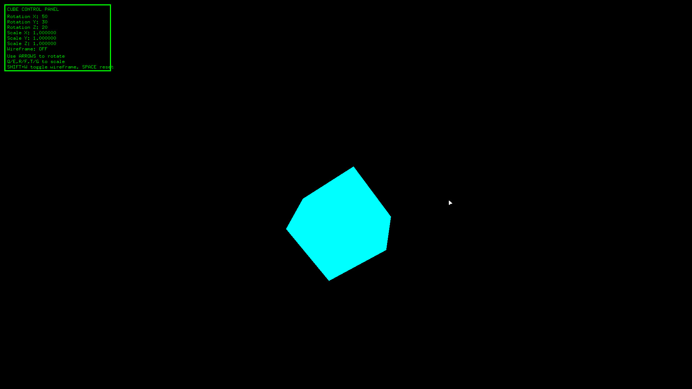
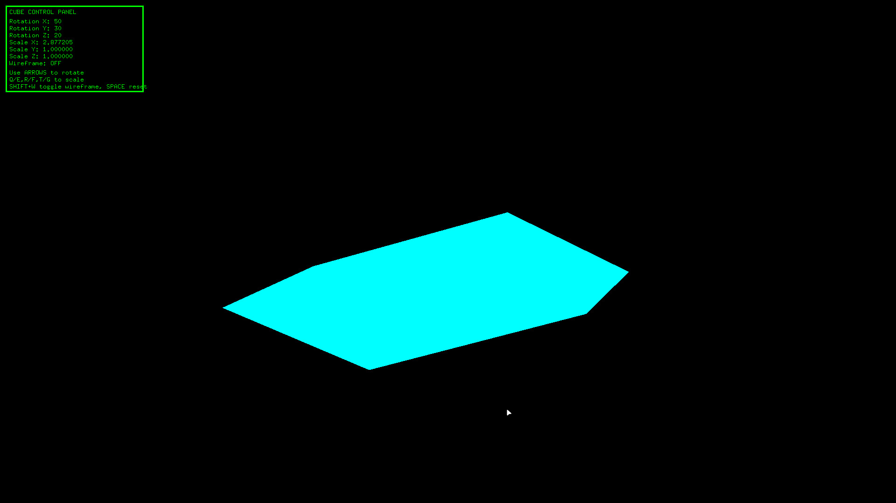

# OpenC++

## Tiny OpenGL cube in C++. Yea i made it quick beacuse i had no time (im sorry :3). It's very basic and i think even a 6 year old can use it!

## Keybinds

Keybinds are easy and are on the User Interface (UI):

* Left click + drag → rotate camera
* W/A/S/D → move camera
* Arrow keys → rotate cube
* Q/E → scale X
* R/F → scale Y
* T/G → scale Z
* Shift+W → toggle wireframe
* Space → reset cube

## Screenshots

